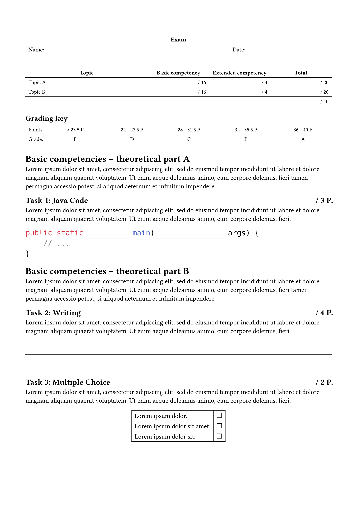
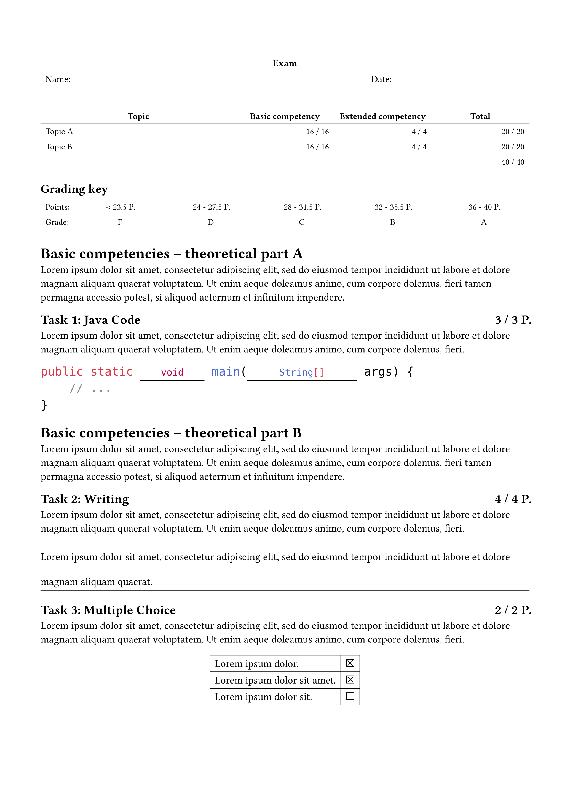

# Scrutinize

Scrutinize is a library for building exams, tests, etc. with Typst.
It has three general areas of focus:

- It helps with grading information: record the points that can be reached for each question and make them available for creating grading keys.
- It provides a selection of question writing utilities, such as multiple choice or true/false questions.
- It supports the creation of sample solutions by allowing to switch between the normal and "pre-filled" exam.

Right now, providing a styled template is not part of this package's scope.
Also, visual customization of the provided question templates is currently nonexistent.

See the [manual](docs/manual.pdf) for details.

## Example

<table>
<tr>
  <td>
    <a href="gallery/gk-ek-austria.typ">
      
    </a>
  </td>
  <td>
    <a href="gallery/gk-ek-austria.typ">
      
    </a>
  </td>
</tr>
</table>

This and more examples can be found in the [gallery](gallery/). Here are some excerpts from the shown example:

```typ
#import "@preview/scrutinize:0.3.0" as scrutinize: grading, task, solution, task-kinds
#import task: t

// ... document setup ...

#context {
  let ts = task.all(level: 2)
  let total = grading.total-points(ts)

  let grades = grading.grades(
    [Nicht Genügend (5)],
    4/8 * total,
    [Genügend (4)],
    5/8 * total,
    [Befriedigend (3)],
    6/8 * total,
    [Gut (2)],
    7/8 * total,
    [Sehr Gut (1)],
  )

  // ... show the grading key ...
}

// ...

= Grundkompetenzen -- Theorieteil B

#lorem(40)

== Text schreiben
#t(category: "b", points: 3)
#lorem(30)

#task-kinds.free-form.lines(stretch: 180%, lorem(20))

== Multiple Choice
#t(category: "b", points: 2)
#lorem(30)

#{
  set align(center)
  task-kinds.choice.multiple((
    (lorem(3), true),
    (lorem(5), true),
    (lorem(4), false),
  ))
}
```
